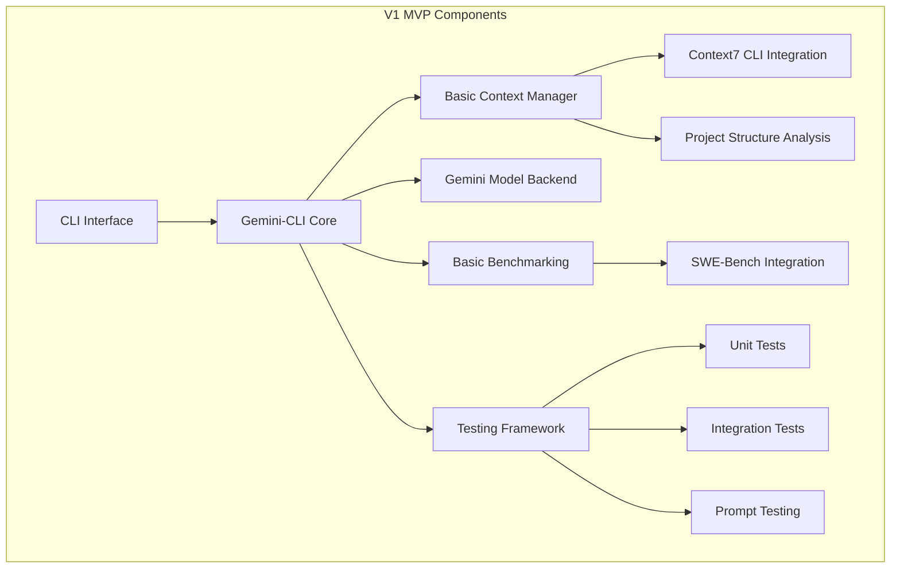

# Design Document

## Overview

The Yelm Coding Agent is designed as a sophisticated CLI-based coding assistant that addresses the fundamental limitation of current coding agents: having the right context at the right time. Built on the Gemini-CLI foundation, it introduces a layered architecture that progressively adds context management, automated learning, adversarial verification, and temporal understanding capabilities.

### Foundation Research

**Gemini CLI Analysis:**
Based on the official Google Gemini CLI repository (https://github.com/google-gemini/gemini-cli):
- **Language**: TypeScript/Node.js with React/Ink for sophisticated terminal UI
- **Architecture**: Modern CLI built with React components for rich terminal interactions
- **Package Manager**: npm workspaces monorepo structure
- **CLI Framework**: React/Ink with custom AppWrapper component system
- **API Integration**: REST API calls to Google's Gemini models with gaxios
- **Build System**: esbuild with comprehensive bundling and distribution

**Technology Stack Decision:**
Building on the existing Gemini CLI React/Ink foundation:
- **Language**: TypeScript for type safety and consistency with base
- **Runtime**: Node.js for CLI execution
- **UI Framework**: React/Ink extending existing Gemini CLI patterns
- **HTTP Client**: gaxios (following their patterns) for API calls
- **Configuration**: JSON/YAML with Zod validation (matching their approach)
- **Testing**: vitest for unit/integration testing, custom framework for prompt testing
- **Build System**: esbuild matching their bundling approach

### Critical Design Review & Roadmap Revision

**Key Insights from Design Review:**
1. **Complexity Management**: Original roadmap was over-ambitious for initial versions
2. **YAGNI Concerns**: Many advanced features should be deferred until core value is proven
3. **Implementation Reality**: Each major feature represents significant complexity and uncertainty
4. **Validation Need**: Each version should prove incremental value before adding complexity

**Revised Version Roadmap:**
- **V1 (MVP)**: Gemini CLI fork + Basic context7 + Simple benchmarking + Core testing
- **V2**: Enhanced context7 reliability + Multi-model support + Project analysis
- **V3**: Basic rules generation (developed repos) + Simple memory/caching
- **V4**: Greenfield rules generation + Post-mortem learning
- **V5**: SWE-Bench integration + Advanced benchmarking infrastructure
- **V6**: Adversarial verification + Multi-agent review cycles
- **V7**: Temporal context + Git history analysis + PR/issue integration
- **V8**: Continuous goal checking + Recovery/offramp systems
- **V9**: Advanced memory management + Cross-session persistence
- **V10+**: Workflow integrations + Technical debt management

### Core Design Principles

1. **Context-First Architecture**: Every component is designed around intelligent context expansion and management
2. **Incremental Enhancement**: Each version builds upon the previous foundation without breaking existing functionality
3. **Prove Before Scale**: Each version must demonstrate measurable improvement before adding complexity
4. **Graceful Degradation**: Components fail independently without breaking core functionality
5. **Practical Implementation**: Design for real-world constraints and failure modes
6. **Continuous Learning**: The system improves through automated post-mortem analysis and rule generation

## Architecture

### High-Level System Architecture

```mermaid
graph TB
    CLI[CLI Interface] --> Core[Core Agent Engine]
    Core --> Context[Context Management Layer]
    Core --> Models[Multi-Model Backend]
    Core --> Memory[Memory & Learning System]
    
    Context --> C7[Context7 Integration]
    Context --> Rules[Rules Engine]
    Context --> Temporal[Temporal Context]
    Context --> Project[Project Analysis]
    
    Models --> Gemini[Gemini API]
    Models --> Kimi[Kimi v2 API]
    Models --> Router[Model Router]
    
    Memory --> PostMortem[Post-Mortem Analysis]
    Memory --> Cache[Context Cache]
    Memory --> Lessons[Lessons Learned DB]
    
    Core --> Adversarial[Adversarial Verification]
    Adversarial --> Optimizer[Optimizer Agent]
    Adversarial --> Auditor[Security Auditor]
    Adversarial --> Synthesizer[Neutral Synthesizer]
    
    Core --> Benchmark[Benchmarking System]
    Benchmark --> SWE[SWE-Bench Runner]
    Benchmark --> Metrics[Performance Metrics]
    
    Core --> Recovery[Recovery System]
    Recovery --> GoalCheck[Goal Checking]
    Recovery --> Offramp[Offramp Mechanism]
```



### V1 MVP Architecture

The initial version focuses on establishing the core foundation with essential context management:



## Components and Interfaces

### 1. Core Agent Engine

The central orchestrator that manages all system components and maintains conversation state.

**Key Responsibilities:**
- Initialize and coordinate all subsystems
- Maintain conversation context and history
- Route requests to appropriate components
- Handle error recovery and graceful degradation
- Manage multi-turn conversations with planning

**TypeScript Implementation:**
```typescript
import { z } from 'zod';

const AgentConfigSchema = z.object({
  modelBackends: z.array(z.any()), // ModelBackend[]
  contextSources: z.array(z.any()), // ContextSource[]
  benchmarkConfig: z.any(), // BenchmarkConfig
  testingConfig: z.any() // TestingConfig
});

type AgentConfig = z.infer<typeof AgentConfigSchema>;

abstract class CoreAgentEngine {
  abstract initialize(config: AgentConfig): Promise<void>;
  abstract processRequest(request: UserRequest): Promise<AgentResponse>;
  abstract maintainContext(context: ConversationContext): void;
  abstract handleError(error: AgentError): Promise<RecoveryAction>;
  abstract shutdown(): Promise<void>;
}
```

### 2. Context Management Layer

Intelligent context expansion system that provides relevant information at the right time.

**V1 Components:**
- **Context7 Integration**: Native CLI-based documentation lookup
- **Project Analysis**: Codebase pattern recognition
- **Context Cache**: Fast retrieval of previously processed context

**V2+ Extensions:**
- **Rules Engine**: Automated pattern learning and application
- **Temporal Context**: Git history analysis
- **Memory System**: Long-term learning and recall

**TypeScript Implementation:**
```typescript
abstract class ContextManager {
  abstract expandContext(request: UserRequest): Promise<ExpandedContext>;
  abstract cacheContext(context: ProcessedContext): void;
  abstract retrieveRelevantContext(query: string): Promise<RelevantContext[]>;
}

abstract class Context7Integration {
  abstract findRelevantDocs(filePath: string): Promise<DocumentationResult[]>;
  abstract analyzeRelevance(docs: DocumentationResult[]): Promise<RelevantSection[]>;
  abstract cacheDocumentation(docs: ProcessedDocs): void;
}
```

### 3. Multi-Model Backend System

Flexible model routing and management system supporting multiple AI providers.

**V1**: Gemini-CLI foundation
**V2**: Multi-model support with intelligent routing

**TypeScript Implementation:**
```typescript
enum ModelCapability {
  CODE_GENERATION = "code_generation",
  CODE_REVIEW = "code_review",
  DOCUMENTATION = "documentation",
  PLANNING = "planning"
}

abstract class ModelBackend {
  abstract get name(): string;
  abstract get capabilities(): ModelCapability[];
  abstract processRequest(request: ModelRequest): Promise<ModelResponse>;
  abstract isAvailable(): Promise<boolean>;
}

abstract class ModelRouter {
  abstract selectBestModel(request: UserRequest): Promise<ModelBackend>;
  abstract routeRequest(request: UserRequest): Promise<ModelResponse>;
  abstract handleFailover(failedModel: ModelBackend): Promise<ModelBackend>;
}
```

### 4. Benchmarking System

Comprehensive performance measurement and comparison framework.

**Components:**
- **SWE-Bench Integration**: Standardized coding benchmark execution
- **Performance Metrics**: Detailed analysis and comparison
- **Historical Tracking**: Long-term performance monitoring
- **Prompt Optimization**: A/B testing for prompt effectiveness

**Interfaces:**
```typescript
interface BenchmarkSystem {
  runBenchmark(benchmark: BenchmarkType): Promise<BenchmarkResult>
  comparePerformance(baseline: string, current: string): Promise<PerformanceComparison>
  trackHistorical(results: BenchmarkResult[]): void
}

interface PromptTester {
  testPromptEffectiveness(prompt: string, testCases: TestCase[]): Promise<PromptMetrics>
  optimizePrompt(basePrompt: string): Promise<OptimizedPrompt>
  abTestPrompts(promptA: string, promptB: string): Promise<ABTestResult>
}
```

### 5. Testing Framework

Comprehensive testing infrastructure for reliability and regression prevention.

**Components:**
- **Unit Testing**: Component-level test coverage
- **Integration Testing**: End-to-end workflow validation
- **Prompt Testing**: AI response quality measurement
- **Benchmark Testing**: Performance regression detection

**Interfaces:**
```typescript
interface TestFramework {
  runUnitTests(): Promise<TestResults>
  runIntegrationTests(): Promise<TestResults>
  runPromptTests(): Promise<PromptTestResults>
  generateCoverageReport(): Promise<CoverageReport>
}
```

## Data Models

### Core Data Structures

```typescript
// User interaction models
interface UserRequest {
  id: string
  timestamp: Date
  content: string
  context: RequestContext
  files?: string[]
  projectPath: string
}

interface AgentResponse {
  id: string
  requestId: string
  content: string
  reasoning?: string
  plan?: ExecutionPlan
  context: ResponseContext
  confidence: number
}

// Context models
interface ExpandedContext {
  documentation: DocumentationContext[]
  projectPatterns: ProjectPattern[]
  historicalContext: HistoricalContext[]
  rules: ApplicableRule[]
}

interface DocumentationContext {
  source: string
  relevantSections: DocumentSection[]
  confidence: number
  cached: boolean
}

// Benchmarking models
interface BenchmarkResult {
  benchmarkType: string
  score: number
  timestamp: Date
  details: BenchmarkDetails
  comparison: PerformanceComparison
}

// Memory and learning models
interface LessonLearned {
  id: string
  context: string
  lesson: string
  applicability: string[]
  confidence: number
  timestamp: Date
}
```

### V2+ Advanced Data Models

```typescript
// Rules and patterns
interface ProjectRule {
  id: string
  pattern: string
  application: string
  confidence: number
  source: RuleSource
  lastUpdated: Date
}

// Adversarial verification
interface AdversarialReview {
  planId: string
  reviews: AgentReview[]
  synthesis: ReviewSynthesis
  finalDecision: Decision
}

interface AgentReview {
  agentType: 'optimizer' | 'auditor' | 'advocate'
  findings: Finding[]
  recommendation: Recommendation
}

// Temporal context
interface HistoricalContext {
  commitHash: string
  prNumber?: number
  issueNumber?: number
  reasoning: string
  impact: string
  relevance: number
}
```

## Error Handling

### Graceful Degradation Strategy

The system is designed to continue operating even when individual components fail:

1. **Context7 Failure**: Continue with basic project analysis
2. **Model Backend Failure**: Fallback to alternative models
3. **Benchmarking Failure**: Log failure, continue normal operation
4. **Memory System Failure**: Operate without historical context
5. **Rules Engine Failure**: Use general best practices

### Error Recovery Mechanisms

```typescript
interface ErrorHandler {
  handleContextFailure(error: ContextError): Promise<FallbackContext>
  handleModelFailure(error: ModelError): Promise<AlternativeModel>
  handleBenchmarkFailure(error: BenchmarkError): Promise<void>
  logError(error: SystemError): void
}
```

## Testing Strategy

### V1 Testing Approach

1. **Unit Testing**
   - Individual component functionality
   - Mock external dependencies
   - Edge case handling
   - Error condition testing

2. **Integration Testing**
   - End-to-end conversation flows
   - Context7 integration workflows
   - Benchmarking pipeline validation
   - Multi-component interaction testing

3. **Prompt Testing**
   - Response quality measurement
   - Consistency across similar inputs
   - Performance optimization
   - A/B testing framework

4. **Benchmark Testing**
   - SWE-Bench execution validation
   - Performance regression detection
   - Comparison accuracy verification
   - Historical tracking validation

### Testing Infrastructure

```typescript
interface TestSuite {
  unitTests: UnitTest[]
  integrationTests: IntegrationTest[]
  promptTests: PromptTest[]
  benchmarkTests: BenchmarkTest[]
}

interface PromptTest {
  prompt: string
  expectedQualities: QualityMetric[]
  testCases: PromptTestCase[]
  successCriteria: SuccessCriteria
}
```

## Performance Considerations

### V1 Performance Targets

- **Response Time**: < 2 seconds for simple queries, < 10 seconds for complex planning
- **Context Retrieval**: < 500ms for cached context, < 3 seconds for fresh context7 lookup
- **Benchmark Execution**: Complete SWE-Bench subset in < 30 minutes
- **Memory Usage**: < 1GB baseline, < 2GB with full context loaded

### Optimization Strategies

1. **Context Caching**: Aggressive caching of documentation and project analysis
2. **Lazy Loading**: Load context components only when needed
3. **Parallel Processing**: Concurrent context expansion and model requests
4. **Smart Batching**: Group related operations for efficiency

## Security Considerations

### Data Protection

- **Local Processing**: Sensitive code remains on local machine
- **API Security**: Secure communication with model backends
- **Context Isolation**: Project contexts remain separate
- **Audit Logging**: Track all system interactions for debugging

### Access Control

- **File System Access**: Restricted to project directories
- **Network Access**: Limited to configured model APIs
- **Configuration Security**: Secure storage of API keys and settings

## Deployment and Configuration

### Installation Process

1. **Repository Setup**: Clone and install dependencies
2. **Model Configuration**: Set up API keys and endpoints
3. **Context7 Setup**: Configure documentation sources
4. **Benchmark Preparation**: Download test datasets
5. **Validation**: Run health checks and basic tests

### Configuration Management

```typescript
interface SystemConfig {
  models: ModelConfig[]
  context: ContextConfig
  benchmarking: BenchmarkConfig
  testing: TestConfig
  logging: LogConfig
}
```

This design provides a solid foundation for the V1 MVP while establishing the architecture patterns needed for future enhancements. The modular approach ensures that each component can be developed, tested, and deployed independently while maintaining system cohesion.